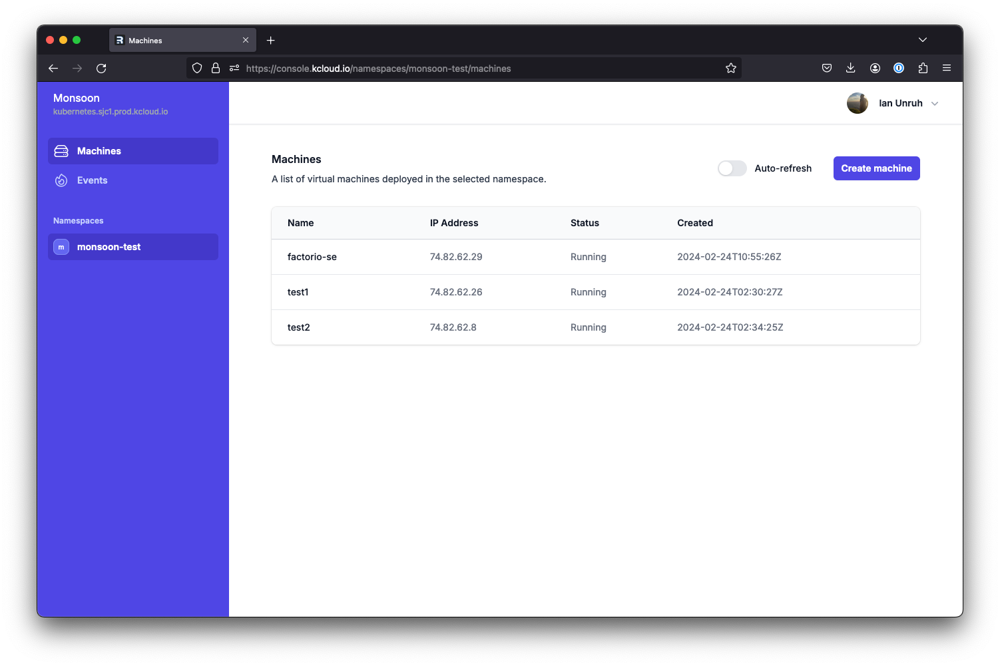
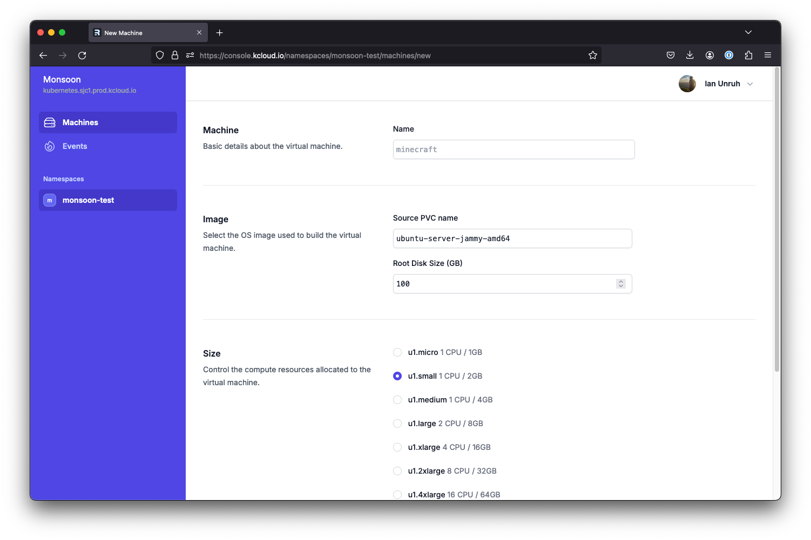

# monsoon

Experimental virtual machine hosting platform based on Remix.js and Kubernetes/Kubevirt.

- Supports OIDC authentication, tested with Dex and GitHub.
- Uses Multus for VM networking.
- Uses Kubernetes for application data, no other database needed.




## Development

Setup the app environment variables based on your own Kubernetes cluster and OIDC provider.

```sh
cp .env.example .env
```

Start the Remix development asset server and the Express server by running:

```sh
npm run dev
```

If your Kubernetes cluster does not have TLS certificates from a public CA, run this instead:

```sh
NODE_TLS_REJECT_UNAUTHORIZED=0 npm run dev
```
